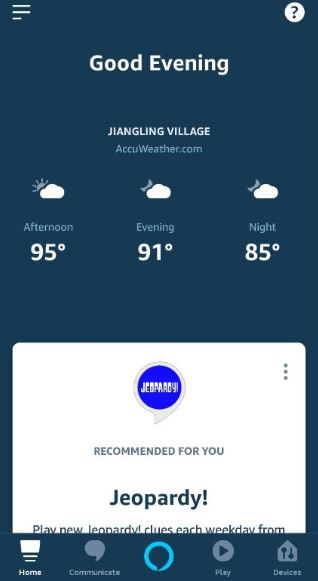

# Gaze Voice Interaction


This is my summer intern project at [Ganzin Tech](https://ganzin.com/).

## Table of Contents

* [Introduction](#introduction)
* [User Guide](#user-guide)
  * [Command](#command)
  * [Possible Replies from Alexa](#possible-replies-from-alexa) 
  * [Demo Video](#demo-video)
* [Workflow](#workflow)
* [Implementation](#implementation)
  * [Prerequisites](#prerequisites)
    * [Hardware](#hardware)
    * [Software](#software)
  * [Alexa Skill](#alexa-skill)
  * [AWS IoT thing ESP32](#aws-iot-thing-esp32)
    * [MQTT](#mqtt)
    * [Steps](#steps)
  * [Raspberry Pi](#raspberry-pi)
    * [Setup RPi](#setup-rpi)
    * [AP mode](#ap-mode)
    * [RESTful API](#restful-api)
  * [Eyetracking](#eyetracking)
    * [Algorithm](#algorithm)
    * [Bright Dot Detection](#bright-dot-detection)
    * [Frequency Calculation](#frequency calculation)
    * [Gaze](#gaze)
* [Demo Video](#demo-video)

## Introduction

Smart home automation has gradually become a part of our daily lives.  It is already achievable to control home appliances with voice command, but imagine voice and eye-gaze controlled devices?

Using AWS service (Alexa skill + AWS IoT Core) and eye-tracking solution from Ganzin Tech, the specific device (in this project, light) that you are looking at can be detected by eye-tracking algorithm and can be activated by voice command.

## User Guide

First, invocate the custom skill using the invocation name, such as "Alexa, open **light control**."  Here, "Alexa" is the trigger word to make the Echo Dot listen, "light control" identifies the skill the user wants to interact with.

After that, Alexa will greet you by saying "Hello, dear user, what can I help you?" 

#### Command

Below are all the commands you can give.

* Turn {on|off} 
* {Dim|Brighten} the light [to ___ percent]
* Turn {on|off} light {one|two}

If you do not specify the brightness percentage, it would dim/brighten the light by 25%.  

The first 2 command require eye-tracking devices.

#### Possible Replies from Alexa

* "Sorry, I don't understand that."  This indicates the given command is not included in the custom skill.
* "I'm not sure which light you are looking at."  This indicates either (1) no blinkers are detected in visual field (2) gaze target not close to the blinker (3) problems with calculation of frequency
* "Sorry, I didn't find a device named ___. "  This means that the skill has been closed, you need to invocate the custom skill again.


## Workflow


## Implementation

### Prerequisites 

You should have the following ready before we start.

#### Hardware

* ESP32-PICO 
* LED (the light you are going to control)
* Echo Dot (or you can use **Amazon Alexa** app)



*With eye-tracking,*

* Raspberry Pi
* Infrared LED (serves as blinker)
* Eye-tracker

#### Software 

* An account in **AWS console**, so that you can access IoT Core, lambda function, and so on.
* An account in **alexa developer console**, so that you can create your own custom skill.

*With eye-tracking,*

* Eye-tracking solution from Ganzin Tech.

### Alexa Skill

1. Go to **alexa developer console**.

2. Set **skill invocation name**. 

3. Create **custom intent** and its sample utterances

   

   

4. Set **slots**.

   The highlight colors above are called slots.  You can create a new slot by specifying its name and slot type.   

   For example, in SetLightIntent, there are 4 slots:

   * switch : on / off
   * number : the number of LED brightness you want to set
   * brightness : brighten / dim
   * LightID : 1 / 2

   

   As for slot type, you can either create a custom one or an existing one. 

   For example, there are only 2 possible states for "switch", namely "on" and "off".  Therefore, I created a custom slot type "LightStatus", with its value "on" and "off".  As for "brightness",  I set "brighten" and "dim" as its accepted values.  Lastly, the slot types for slots "number" and "LightID" is AMAZON.NUMBER, which converts numeric words (“five”) into digits (such as “5”).

   

5. In AWS console, go to Services/IAM.  Create a custom **IAM** (Identity and Access Management) **role**, and then attach policies so that lambda functions using this role can access certain AWS services like IoT data.

   

   

6. In AWS console, go to **Services/Lambda**.  Create a custom lambda function, in my case, 'ControlLight'.  Make sure to use the existing role that has been created in step 5.  

   Click 'Add trigger' and select Alexa Skills Kit, then fill in the skill ID (you can find it in alexa developer console/Alexa Skills).  You should see the figure below after you finish.

   

7. In Alexa Developer Console, go to CUSTOM/Endpoint.  Select AWS Lambda ARN and fill in the default region with the ARN of your custom lambda function.

   (1) Find ARN in Services/Lambda.

   

   

   (2) In Alexa Developer Console, paste the ARN in Default Region.

   

8. Let's dive into the lambda function!  I modified [sample code - hello world](https://github.com/alexa/skill-sample-python-first-skill/blob/master/module-1/lambda_function.py) by changing HelloWorldIntentHandler into SetLightIntentHandler.  (Remember we have created a custom intent "SetLightIntent" in step 3). 

   **My algorithm: **

   If LightID is specified by voice command, set the topic based on that ID (my_iot/switch{LightID}/1). Otherwise, get it from RESTful API (contains the info of eye-tracking).

   Set payload that will be published to topic like below:

   ​	(1) $ number : set the light to that brightness, ex: "turn on" will be translated to "$ 100", "brighten the light to fifty percent" will be translated to "$ 50".

   ​	(2) + 25		   :  brighten the light by 25%, ex: "brighten the light" will be translated to "+ 25".

   ​	(3) - 25 	       : dim the light by 25%, ex: "dim the light" will be translated to "- 25".

9. In requirements.txt, you can already see 'boto3' and 'ask-sdk-core'.  If any more packages are needed, add it in requirements.  In my case, I add package 'requests' and 'simplejson'. 

   Then, run the following command so that all the modules you need will be inside the lambda folder.

   ```
   python3 -m pip install -r requirements.txt -t lambda
   ```

   Afterwards, put all the python files and requirements.txt into that folder and compress it to zip.

   

   Back to AWS console Services/Lambda, in function code, click 'Actions' and upload the zip file.

10. Then you can test if everything is working fine.  Go to alexa developer console/Test and test your commands.  In AWS IoT console, subscribe to my_iot/switch{LightID}/1 to see if the payload is correctly sent from Alexa console.

    

   

### AWS IoT thing ESP32

In this section, we are going to connect your devices (esp32) to AWS IoT Data.

#### MQTT


#### Steps

1. Create your thing object in AWS IoT and connect your device to it (follow [Getting started with the Espressif ESP32-DevKitC and the ESP-WROVER-KIT](https://docs.aws.amazon.com/freertos/latest/userguide/getting_started_espressif.html)).
2. Modify code ([amazon-freertos](https://github.com/aws/amazon-freertos)/demos/mqtt) so that you can send and receive MQTT messages in ESP32.  For example, when receiving payload ($ 100, indicating turn on), pull up GPIO pin.  ([GPIO sample code](https://docs.espressif.com/projects/esp-idf/en/latest/esp32/#))
3. Use PWM ([manual](https://docs.espressif.com/projects/esp-idf/en/latest/esp32/api-reference/peripherals/ledc.html#api-reference) to set frequency and duty cycle) so that the blinker (infrared LED) flickers at a certain frequency.
4. Note: for different devices, make sure to use different codes!


### Raspberry Pi 

There are 2 main functions for RPi.  First, it serves as a hotspot for esp32, so that the whole project is **portable**.  Second, RESTfulAPI running on RPi makes it easy for users to access and update data in real time. 

#### Setup RPi

1. Download the latest image with Desktop ([link](https://www.raspberrypi.org/downloads/raspberry-pi-os/)), then unzip the image file.  

2. Write the image to the SD card by command:

   ```
   dd bs=4M if=20XX-XX-XX-raspios-buster.img of=/dev/sdX status=progress conv=fsync
   ```

#### AP mode

1. Follow the [link](https://atceiling.blogspot.com/2020/03/raspberry-pi-64raspap.html)
2. Change wifi SSID (default: raspi-webgui) and PASSWORD (default: ChangeMe)

#### RESTful API

Here, this RESTful API is a public IP that everyone can access.

1. Follow the [tutorial - use python and flask to design RESTful API](http://www.pythondoc.com/flask-restful/first.html), we only need GET & POST.

2. Use GET in lambda function so as to access the light ID stored in RESTful API.

3. Use POST in the eye tracker so as to update the light ID that the user is gazing at.

   ```python
   # ~/Desktop/app.py
   from flask import Flask, jsonify, abort, request
   app = Flask ( __name__ )
   
   light = {'id': 1}
   
   @app.route('/')
   def index():
       return "Hello, Ganzin user"
   
   @app.route('/light', method=['GET'])
   def get_light():
       return jsonify(light)
   
   @app.route('/light', method=['PUT'])
   def update_light():
       if not request.json:
           abort(400)
       light['id'] = request.json.get('id', light['id'])
       return jsonify(light)
   
   if __name__ == '__main__':
       app.run(host='fill in your IP address', port=fill_in_arbitrary_number, debug=True)
   ```

4. Run RESTful API as a daemon, so that it will launch automatically when RPi is working.

   Say you have a script /usr/bin/mydaemon.  Make sure to ```sudo chmod +x /usr/bin/mydaemon```

   ```bash
   #! /bin/sh
   python ~/Desktop/app.py
   ```

   Create a file: ```sudo vim /etc/systemd/system/mydaemon.service```

   ```
   [Unit]
   Description=My daemon
   After=network.target
   StartLimitIntervalSec=0
   
   [Service]
   ExecStart=/usr/bin/mydaemon
   Restart=on-failure
   RestartSec=1
   User=pi
   Group=pi
   
   [Install]
   WantedBy=multi-user.target
   ```

   To ask systemd to add a new service:

   ```
   sudo systemctl daemon-reload
   
   # To start the demon
   systemctl start mydaemon.service
   
   # To start at boot
   systemctl enable mydaemon.service
   ```

5. RESTful API (website)

   

### Eyetracking 

Given the eye-tracker, which is able to detect the gaze target of any users, from Ganzin Tech, I use the algorithm below to distinguish 2 IoT devices.


*Notes: codes related to eye-tracking are not provided due to confidentiality.*

#### Algorithm

Place a blinker (infrared LED) next to the light the user wants to control.  Since the eye-tracker sends the camera stream with timestamp back to the computer, we can tell if there's a blinker in the user's visual field.  Afterwards, check if the gaze target and the blinker are close in scene (the user's visual field).  

Once the scene camera spots a blinker (the light is located in the user's visual field) and the gaze target is close to that blinker, its respective LED ID will be updated to RESTful API.  

#### Bright Dot Detection

Use the square below to scan the entire image.


If the inner square is brighter than the outer one to an extent, it is likely that a bright dot is detected.  Here, all locations with their responses higher than the defined threshold would be saved in a list.  

The above is realized by a function, which returns a list of detected light on the current time frame.  

#### Frequency Calculation

If the duration of a bright dot is more than 1 second, calculate its frequency.  If it lies in a certain range, it indicates that the blinker is in the user's visual field.

```
frequency = number of state changes / 2 / duration
```

Here, I set the 2 blinkers to be 3 Hz (80% duty cycle) and 5 Hz (20% duty cycle).

#### Gaze

Constantly check if the gaze target is close to any blinkers (which indicate IoT devices).  If yes, use PUT to update LED id stored on RESTful API.

If a user has not looked at any IoT devices for the past 5 seconds, use PUT to update LED id to -1.  Alexa would say "I'm not sure which light you are looking at." if a user attempts to use the eye-tracker to control a light.

## Demo Video

[](https://drive.google.com/file/d/1S6WQp55lWSO89Zs-E2BUqUDvfxDh-2jD/view?usp=sharing)